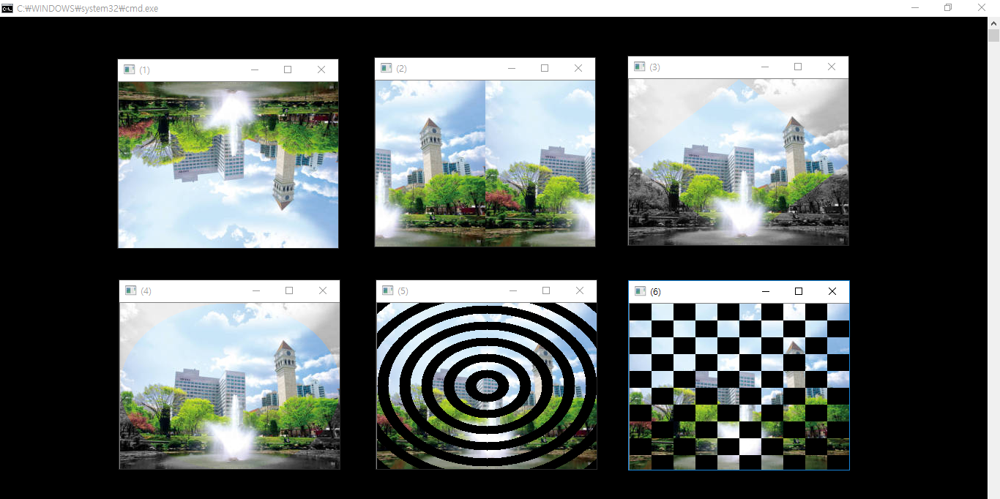
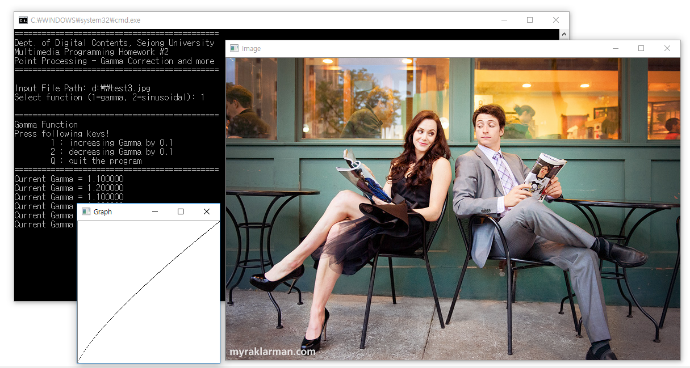
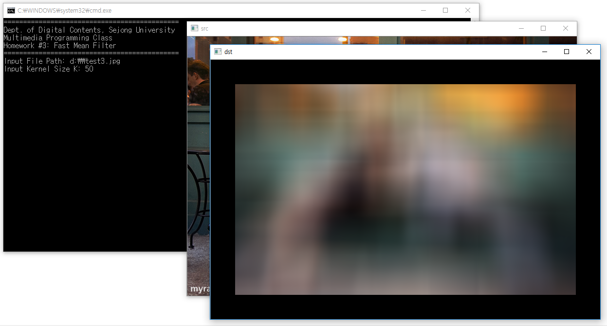
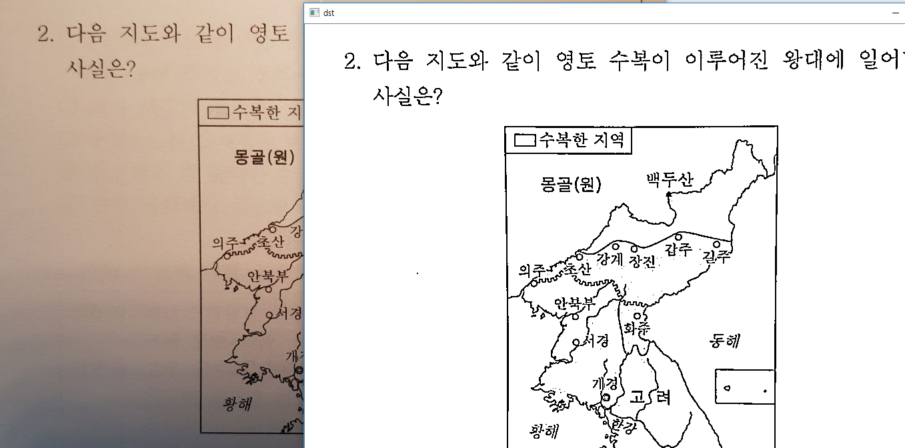
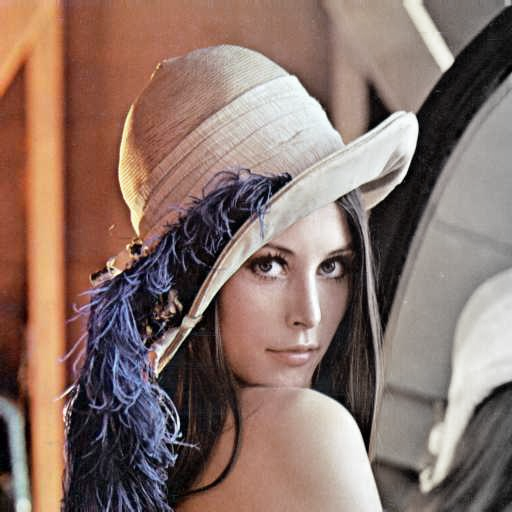
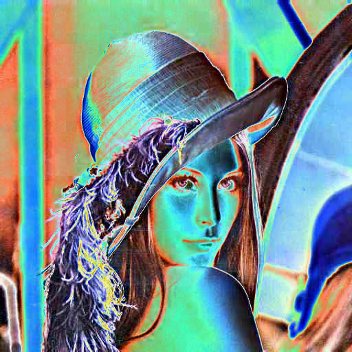
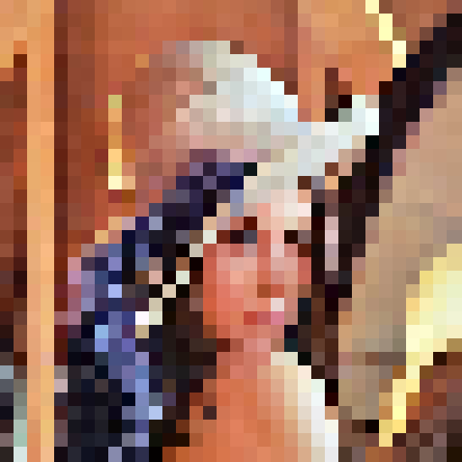
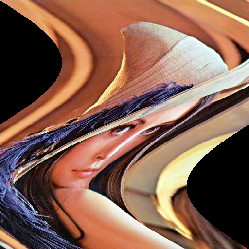

# Multimedia programming

This repository is for **Multimedia programming** lecture related material and assignments  
I've not uploaded lecture notes, personal paper works and opened to public due to copyright issues  

---
## Summary
### Assignments

</img>
</img>
</img>
</img>

### Exam practices

</img>
</img>
</img>
</img>
</img>
</img>

---

## Library
C++ based on OpenCV  
For more information visit: 
* [OpenCV officials](https://opencv.org/) 
* [OpenCV installation guide](https://github.com/ameliacode/Multimedia_programming/blob/master/install_guide.md)

